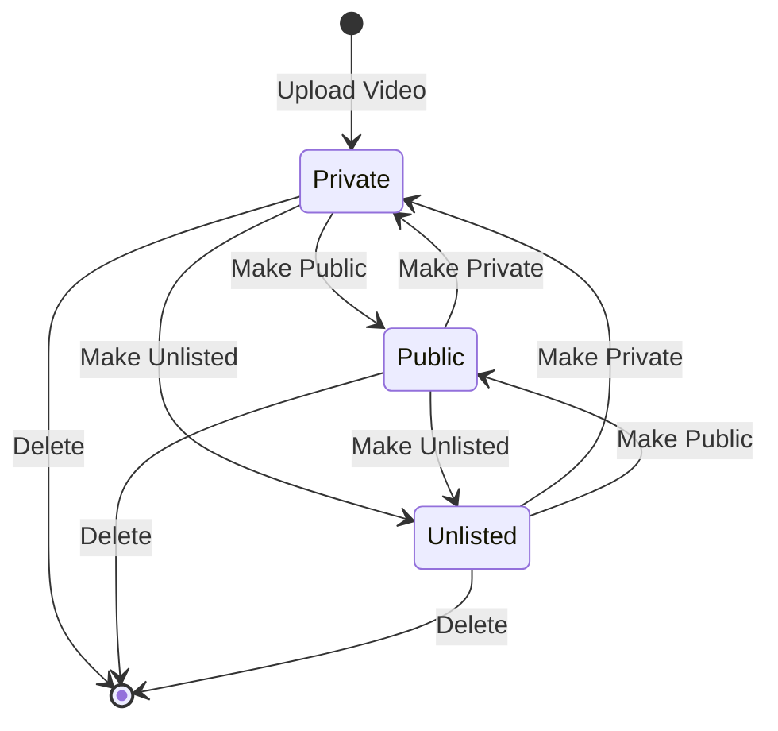

## Overview

The privacy management feature allows users to update the privacy status of their uploaded videos and permanently delete videos from YouTube. All changes are synchronized between the local database and YouTube.

## Privacy States

YouTube videos can have three privacy states:

<CardGroup cols={3}>
  <Card title="Private" icon="lock">
    Only you and users you choose can view the video. It won't appear in search results, recommendations, or the channel's video tab.
  </Card>
  
  <Card title="Public" icon="globe">
    Anyone can search for and view the video. It appears in search results, recommendations, and the channel's video tab.
  </Card>
  
  <Card title="Unlisted" icon="link">
    Anyone with the video link can watch it, but it won't appear in search results, recommendations, or the channel's video tab.
  </Card>
</CardGroup>

## Changing Privacy Status

The `cambiar_estado_video` view (`views.py:266-293`) updates video privacy:

```python
@login_required
def cambiar_estado_video(request, db_id):
    """Cambia de Privado a Público o viceversa"""
    video_local = get_object_or_404(VideoSubido, id=db_id, user=request.user)
    
    if request.method == 'POST':
        nuevo_estado = request.POST.get('nuevo_estado')
        
        youtube = get_youtube_service(request)
        try:
            # Actualizar en YouTube
            youtube.videos().update(
                part='status',
                body={
                    'id': video_local.video_id,
                    'status': {'privacyStatus': nuevo_estado}
                }
            ).execute()
            
            # Actualizar en Django
            video_local.estado = nuevo_estado
            video_local.save()
            messages.success(request, "Privacidad actualizada correctamente.")
            
        except Exception as e:
            messages.error(request, f"Error actualizando en YouTube: {e}")
            
    return redirect('mis_subidos')
```

## Update Workflow

<Steps>
  <Step title="User Selects New Privacy">
    The user selects a new privacy state from a dropdown and submits the form.
  </Step>
  
  <Step title="Retrieve Video Record">
    The view fetches the video from the database using `get_object_or_404()` with ownership verification.
  </Step>
  
  <Step title="Update YouTube API">
    The `videos().update()` method changes the privacy status on YouTube's servers.
  </Step>
  
  <Step title="Update Local Database">
    The local database record is updated to match YouTube's state.
  </Step>
  
  <Step title="Confirm to User">
    A success or error message is displayed.
  </Step>
  
  <Step title="Redirect">
    The user is returned to their uploaded videos list.
  </Step>
</Steps>

## API Update Request

The YouTube API update call (`views.py:276-282`) uses the `videos().update()` method:

```python
youtube.videos().update(
    part='status',
    body={
        'id': video_local.video_id,
        'status': {'privacyStatus': nuevo_estado}
    }
).execute()
```

### Parameters

<ParamField path="part" type="string" required>
  Specifies which resource property to update. Set to `'status'` to modify privacy settings.
</ParamField>

<ParamField path="body.id" type="string" required>
  YouTube video ID of the video to update.
</ParamField>

<ParamField path="body.status.privacyStatus" type="string" required>
  New privacy state: `'private'`, `'public'`, or `'unlisted'`.
</ParamField>

<Info>
The API call only updates the specified parts. Other video metadata remains unchanged.
</Info>

## Database Synchronization

After successfully updating YouTube, the local database is synchronized (`views.py:285-287`):

```python
video_local.estado = nuevo_estado
video_local.save()
messages.success(request, "Privacidad actualizada correctamente.")
```

This ensures:
- Local records match YouTube's state
- Users see accurate privacy status in the UI
- No need to query YouTube API for display purposes

<Warning>
If the YouTube API call fails, the local database is NOT updated, maintaining consistency.
</Warning>

## Authorization and Security

### Ownership Verification

```python
video_local = get_object_or_404(VideoSubido, id=db_id, user=request.user)
```

The query ensures:
1. The video exists in the database
2. The authenticated user owns the video
3. Returns 404 if either condition fails

<Note>
Users cannot modify the privacy settings of videos uploaded by other users, even if they have the database ID.
</Note>

### Authentication Requirements

The view requires:
- Django user authentication via `@login_required`
- Valid YouTube API credentials in session
- OAuth scope: `https://www.googleapis.com/auth/youtube`

## Deleting Videos

The `borrar_video_subido` view (`views.py:295-313`) permanently removes videos:

```python
@login_required
def borrar_video_subido(request, db_id):
    """Borra el video de YouTube y de la base de datos"""
    video_local = get_object_or_404(VideoSubido, id=db_id, user=request.user)
    
    youtube = get_youtube_service(request)
    try:
        # Borrar de YouTube
        youtube.videos().delete(id=video_local.video_id).execute()
        
        # Borrar de Django
        video_local.delete()
        messages.success(request, "Video eliminado de YouTube y de tu registro.")
        
    except Exception as e:
        messages.error(request, f"No se pudo borrar de YouTube (quizás ya no existe), pero se eliminará localmente. Error: {e}")
        video_local.delete()
        
    return redirect('mis_subidos')
```

## Deletion Workflow

<Steps>
  <Step title="User Confirms Deletion">
    The user clicks a delete button and confirms the action (typically via JavaScript confirmation).
  </Step>
  
  <Step title="Retrieve Video Record">
    Fetch and verify ownership of the video to be deleted.
  </Step>
  
  <Step title="Delete from YouTube">
    Call YouTube's `videos().delete()` API to permanently remove the video.
  </Step>
  
  <Step title="Delete from Database">
    Remove the local database record.
  </Step>
  
  <Step title="Handle Errors">
    If YouTube deletion fails (e.g., video already deleted), still remove the local record.
  </Step>
  
  <Step title="Confirm and Redirect">
    Display a success message and return to the video list.
  </Step>
</Steps>

## YouTube Deletion API

The deletion API call is straightforward (`views.py:302`):

```python
youtube.videos().delete(id=video_local.video_id).execute()
```

<Warning>
**Permanent Action:** Video deletion is irreversible. The video cannot be recovered once deleted from YouTube.
</Warning>

## Error Handling

### Graceful Degradation

If the YouTube API call fails (`views.py:309-311`):

```python
except Exception as e:
    messages.error(request, f"No se pudo borrar de YouTube (quizás ya no existe), pero se eliminará localmente. Error: {e}")
    video_local.delete()
```

The local database record is still deleted to prevent:
- Orphaned records that reference non-existent YouTube videos
- Confusion in the UI showing videos that don't exist
- Blocking user from retrying the operation

<Info>
This is appropriate because if YouTube deletion fails, the video is likely already deleted or the user no longer has access.
</Info>

### Common Error Scenarios

<CardGroup cols={2}>
  <Card title="Video Already Deleted" icon="trash">
    If the video was deleted through YouTube's interface, the API returns an error, but local cleanup proceeds.
  </Card>
  
  <Card title="Insufficient Permissions" icon="ban">
    If OAuth credentials are invalid or expired, the user is prompted to re-authenticate.
  </Card>
  
  <Card title="Network Failure" icon="wifi-slash">
    Temporary network issues may cause the API call to fail. The local record is removed to allow retry.
  </Card>
  
  <Card title="API Quota Exceeded" icon="gauge-high">
    YouTube API quota limits may temporarily prevent operations.
  </Card>
</CardGroup>

## URL Configuration

Privacy management routes are defined in `urls.py:23-24`:

```python
path('mis-videos/actualizar/<int:db_id>/', views.cambiar_estado_video, name='actualizar_estado'),
path('mis-videos/borrar/<int:db_id>/', views.borrar_video_subido, name='borrar_subido'),
```

### Route Parameters

<ParamField path="db_id" type="integer" required>
  The local database primary key (not YouTube video ID) of the video to modify.
</ParamField>

<Note>
Using the database ID instead of YouTube video ID in URLs provides an additional security layer by obscuring YouTube video IDs.
</Note>

## State Flow Diagram



## User Feedback

The application provides clear feedback for all operations:

**Privacy Update Success:**
```python
messages.success(request, "Privacidad actualizada correctamente.")
```

**Privacy Update Failure:**
```python
messages.error(request, f"Error actualizando en YouTube: {e}")
```

**Deletion Success:**
```python
messages.success(request, "Video eliminado de YouTube y de tu registro.")
```

**Deletion Partial Failure:**
```python
messages.error(request, f"No se pudo borrar de YouTube (quizás ya no existe), pero se eliminará localmente. Error: {e}")
```

## Best Practices

<CardGroup cols={2}>
  <Card title="Sync YouTube First" icon="cloud">
    Always update YouTube before the local database to maintain consistency.
  </Card>
  
  <Card title="Verify Ownership" icon="user-check">
    Use `get_object_or_404` with user filter to prevent unauthorized access.
  </Card>
  
  <Card title="Graceful Errors" icon="triangle-exclamation">
    Handle API failures gracefully, especially for delete operations.
  </Card>
  
  <Card title="Confirm Deletions" icon="circle-question">
    Use JavaScript confirmations to prevent accidental deletions.
  </Card>
</CardGroup>

## API Quota Impact

<Note>
**Quota Costs:**
- Privacy update: 50 units
- Video deletion: 50 units

The default quota is 10,000 units per day.
</Note>

## Future Enhancements

- **Scheduled Privacy Changes:** Allow scheduling videos to become public at a specific time
- **Bulk Operations:** Update privacy for multiple videos simultaneously
- **Privacy History:** Track privacy state changes over time
- **Advanced Restrictions:** Set geographic restrictions or age limitations
- **Soft Delete:** Implement a "trash" system with recovery period before permanent deletion
- **Privacy Templates:** Save and apply privacy presets to new uploads