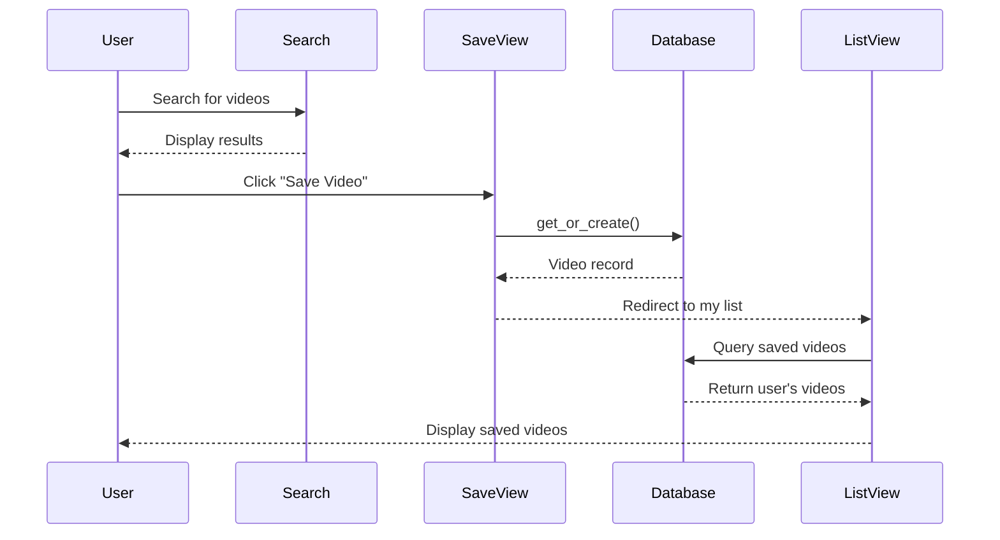

## Overview

The saved videos feature allows users to bookmark their favorite YouTube videos and manage them in a personal collection. Videos are stored in a MySQL database with metadata for quick access.

## Database Model

The `VideoGuardado` model (`models.py:4-18`) defines the schema for saved videos:

```python
class VideoGuardado(models.Model):
    user = models.ForeignKey(User, on_delete=models.CASCADE)
    video_id = models.CharField(max_length=50)
    titulo = models.CharField(max_length=255)
    canal = models.CharField(max_length=255)
    descripcion = models.TextField()
    miniatura_url = models.URLField()
    fecha_guardado = models.DateTimeField(auto_now_add=True)

    class Meta:
        unique_together = ('user', 'video_id')

    def __str__(self):
        return self.titulo
```

### Model Fields

<ResponseField name="user" type="ForeignKey" required>
  Links the saved video to a Django user. Uses `CASCADE` deletion to remove saved videos when a user is deleted.
</ResponseField>

<ResponseField name="video_id" type="CharField(50)" required>
  YouTube's unique video identifier (e.g., `dQw4w9WgXcQ`).
</ResponseField>

<ResponseField name="titulo" type="CharField(255)" required>
  The video's title at the time it was saved.
</ResponseField>

<ResponseField name="canal" type="CharField(255)" required>
  Name of the YouTube channel that uploaded the video.
</ResponseField>

<ResponseField name="descripcion" type="TextField" required>
  Video description text.
</ResponseField>

<ResponseField name="miniatura_url" type="URLField" required>
  URL to the video's thumbnail image for display.
</ResponseField>

<ResponseField name="fecha_guardado" type="DateTimeField">
  Automatically set timestamp when the video is saved.
</ResponseField>

### Database Constraints

The model uses a composite unique constraint:

```python
class Meta:
    unique_together = ('user', 'video_id')
```

<Info>
This prevents users from saving the same video multiple times while allowing different users to save the same video.
</Info>

## Saving Videos

The `guardar_video` view (`views.py:143-167`) handles saving videos to the database:

```python
@login_required
def guardar_video(request):
    if request.method == 'POST':
        # Obtenemos datos del formulario oculto
        video_id = request.POST.get('video_id')
        titulo = request.POST.get('titulo')
        canal = request.POST.get('canal')
        descripcion = request.POST.get('descripcion')
        miniatura = request.POST.get('miniatura')
        
        # Guardamos en MySQL
        VideoGuardado.objects.get_or_create(
            user=request.user,
            video_id=video_id,
            defaults={
                'titulo': titulo,
                'canal': canal,
                'descripcion': descripcion,
                'miniatura_url': miniatura
            }
        )
        messages.success(request, 'Video guardado correctamente.')
        return redirect('mi_lista')
        
    return redirect('inicio')
```

### How It Works

<Steps>
  <Step title="Form Submission">
    The user clicks a "Save" button on a video card, submitting a POST request with video metadata.
  </Step>
  
  <Step title="Extract Data">
    Video information (ID, title, channel, description, thumbnail) is extracted from POST parameters.
  </Step>
  
  <Step title="Database Insert">
    `get_or_create()` is used to insert the video or retrieve it if already saved.
  </Step>
  
  <Step title="Success Feedback">
    A success message is displayed to the user.
  </Step>
  
  <Step title="Redirect">
    The user is redirected to their saved videos list.
  </Step>
</Steps>

<Note>
Using `get_or_create()` prevents duplicate entries even without form validation, ensuring data integrity at the database level.
</Note>

## Viewing Saved Videos

The `mi_lista` view (`views.py:169-172`) displays all saved videos for the current user:

```python
@login_required
def mi_lista(request):
    videos = VideoGuardado.objects.filter(user=request.user).order_by('-fecha_guardado')
    return render(request, 'mi_lista.html', {'videos': videos})
```

### Query Details

**Filtering:**
```python
VideoGuardado.objects.filter(user=request.user)
```
Retrieves only videos saved by the authenticated user.

**Ordering:**
```python
.order_by('-fecha_guardado')
```
Sorts videos by save date in descending order (most recent first).

<CardGroup cols={2}>
  <Card title="User Isolation" icon="user-lock">
    Each user sees only their own saved videos through the user filter.
  </Card>
  
  <Card title="Chronological Display" icon="calendar">
    Videos appear in reverse chronological order for easy access to recent saves.
  </Card>
</CardGroup>

## Deleting Saved Videos

The `eliminar_video` view (`views.py:174-179`) removes videos from the saved list:

```python
@login_required
def eliminar_video(request, video_id):
    video = get_object_or_404(VideoGuardado, id=video_id, user=request.user)
    video.delete()
    messages.warning(request, 'Video eliminado de tu lista.')
    return redirect('mi_lista')
```

### Security Features

**Authorization Check:**
```python
video = get_object_or_404(VideoGuardado, id=video_id, user=request.user)
```

This ensures:
1. The video exists in the database
2. The video belongs to the authenticated user
3. Returns 404 if either condition fails

<Warning>
Attempting to delete another user's saved video will result in a 404 error, preventing unauthorized deletions.
</Warning>

### Deletion Flow

<Steps>
  <Step title="User Clicks Delete">
    The delete button sends a request to `/eliminar/<video_id>/`.
  </Step>
  
  <Step title="Lookup and Verify">
    The view retrieves the video and verifies ownership.
  </Step>
  
  <Step title="Delete Record">
    The database record is removed with `.delete()`.
  </Step>
  
  <Step title="Display Feedback">
    A warning message confirms the deletion.
  </Step>
  
  <Step title="Refresh List">
    The user is redirected back to their video list.
  </Step>
</Steps>

## URL Configuration

Saved video routes are defined in `urls.py:17-19`:

```python
path('guardar/', views.guardar_video, name='guardar_video'),
path('mi-lista/', views.mi_lista, name='mi_lista'),
path('eliminar/<int:video_id>/', views.eliminar_video, name='eliminar_video'),
```

### Route Parameters

<ParamField path="video_id" type="integer" required>
  The database primary key (not YouTube video ID) used for deletion.
</ParamField>

<Info>
Note that `eliminar_video` uses the database `id` field, while `guardar_video` uses YouTube's `video_id`.
</Info>

## Data Flow Diagram



## Message Feedback

The application uses Django's messages framework for user feedback:

**Success (Save):**
```python
messages.success(request, 'Video guardado correctamente.')
```

**Warning (Delete):**
```python
messages.warning(request, 'Video eliminado de tu lista.')
```

<Tip>
Messages appear as Bootstrap alerts in the template, providing immediate visual feedback.
</Tip>

## Authentication Requirements

All saved video views require authentication:

```python
@login_required
def guardar_video(request):
```

Unauthenticated requests are redirected to the login page (configured in `settings.py:120`):

```python
LOGIN_URL = '/login/'
```

## Database Schema

### Table: core_videoguardado

| Column | Type | Constraints |
|--------|------|-------------|
| id | INT | PRIMARY KEY, AUTO_INCREMENT |
| user_id | INT | FOREIGN KEY → auth_user(id), CASCADE |
| video_id | VARCHAR(50) | NOT NULL |
| titulo | VARCHAR(255) | NOT NULL |
| canal | VARCHAR(255) | NOT NULL |
| descripcion | TEXT | NOT NULL |
| miniatura_url | VARCHAR(200) | NOT NULL |
| fecha_guardado | DATETIME | NOT NULL, AUTO |

**Unique Constraint:** (user_id, video_id)

## Best Practices

<CardGroup cols={2}>
  <Card title="Idempotent Saves" icon="check-double">
    Using `get_or_create()` makes save operations idempotent - clicking save multiple times has no side effects.
  </Card>
  
  <Card title="User Isolation" icon="shield">
    All queries filter by authenticated user, ensuring data privacy.
  </Card>
  
  <Card title="Cascade Deletion" icon="trash-cascade">
    When a user is deleted, their saved videos are automatically removed.
  </Card>
  
  <Card title="Metadata Storage" icon="database">
    Storing video metadata prevents the need for API calls when displaying saved videos.
  </Card>
</CardGroup>

## Future Enhancements

- **Collections/Playlists:** Group saved videos into custom collections
- **Tags:** Add user-defined tags for organization
- **Notes:** Allow users to add personal notes to saved videos
- **Export:** Enable exporting saved videos to CSV or JSON
- **Sharing:** Share saved video collections with other users